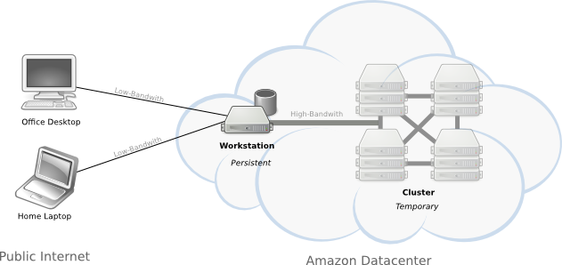

##############
Cirrus Cluster
##############

A batteries-include MapReduce environment for academics, engineers, and researchers.

**What does it do?**

Cirrus makes it easier to perform large-scale computation and data analysis tasks using the MapReduce framework.  While MapReduce is widely used in industry, the high cost and complexity of accessing a MapReduce infrastructure make it impractical for many potential users.  Cirrus Cluster is a python library and set of command line tools that automates the complex processes of provisioning, launching, configuring, and monitoring a custom MapR hadoop cluster.  Cirrus aims to be a batteries-include tool to support a MapReduce workflow tailored for the needs of engineers and researchers who don't have a full-time IT support staff to manage the cluster.

**How does it work?**

Cirrus Cluster creates a computing environment on Amazon's EC2 cloud with all the required software installed and ready to use. This environment consists of two elements: the workstation and the cluster. You connect to the workstation from your local machine.  From the workstation, you can prepare your datasets test your code and eventually launch a cluster to run a complex processing pipeline on your datasets.

*Cirrus Cluster Computing Environment*

:workstation: A persistent remote workstation setup for you in the AWS cloud.

:cluster: A temporary cluster setup for you in the AWS cloud on-demand.

**How much does it cost?**

Cirrus Cluster is open source software and free to use and improve.  However, you pay amazon for whatever resources you use.  Roughly $1 per day to run the workstation and $6 per hour to run a typical cluster.  See the :ref:`estimating costs <costs>` section for details.

Contents
--------

.. toctree::
   :maxdepth: 2
   
   demo/demo
   manual/manual
   
   

